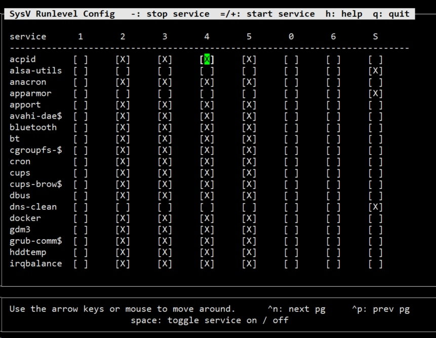

# Linux 服务
相比于Ubuntu，更喜欢红帽系列的服务管理，我觉得红帽的Linux对RPM包默认安装的服务更加友好，比如启动管理和状态查看。
## 服务的分类
- RPM包安装的服务
- 源码包安装的服务

二者的主要区别是安装位置的不同。RPM包安装在默认位置中,源码包安装在指定位置，一般是`/usr/local/`,一般可以更改。
## 服务的启动
一般RMP包的启动脚本都在/etc/init.d/目录下。除了通用的`/etc/init.d/独立服务名 start|stop|status|restart`启动方式外，CentOS还支持`service 独立服务名 start|stop|restart|status`的方式。
## 服务的自启动
对于CentOS，有一下三种方法
- chkconfig [--level 运行级别] [独立服务名] [on|off] 
- ntsysv命令
- 修改/etc/rc.d/rc.local文件

对于Ubuntu，有点小墨迹，先看这个图：

这个图说明，ubuntu下，不同的系统运行级别有自己的目录，打开rd3的目录，我们发现里面都是软链接，指向我们之前提到的启动脚本。

> 对于以K开头的文件，系统将终止对应的服务；
> 对于以S开头的文件，系统将启动对应的服务；

这时我们已经知道怎么搞了，但是怎么命名软连接呢...没有chkconfig那么爽的工具，有点难受，后来我发现了`sysv-rc-conf `.
> 有一次安装找不到这东西，后来发现是因为他source.list就用了清华的源，添加`deb http://archive.ubuntu.com/ubuntu/ trusty main universe restricted multiverse`就好了


按空格进行将启动项反选，其他的都很好懂。

## 自启动存在的问题
对于非RPM包的程序或者干脆是自己写的程序，如何自启动呢，网上给了一大堆设置自启动脚本的办法。但是我一直都用一个比较放肆的办法，无论是centos的chkconfig和service还是ubuntu的sysv-rc-conf，能处理RMP包的服务不是因为他们有啥特异功能，就是因为他们只看/etc/init.d目录下的启动脚本。没什么其他的耦合！所以你可以把你的启动脚本放进去，虽然这样会让高手觉得不优雅(这样做多了会影响纯净的init.d目录)，但是未来某一天当另一个人接手的时候，我觉得这种方式更容易说明白。因为我们就放了一个脚本用sysv-rc-conf设置了一下，没那么复杂的步骤。

# 系统管理
很多时候要尽快的熟悉一个新的系统，而在你面前的应该只有一个虚拟终端。
## 进程和job查看
ps top pstree w who fg bg jobs & nohop kill -1 kill -9这些不多说了需要的可以去man一下。这里就说一个好玩的，pkill踢出用户~
```
$ who
pris_syn pts/2        2019-01-28 15:57 (127.0.0.1)
pris_syn pts/3        2019-02-02 18:29 (127.0.0.1)
pris_syn pts/4        2019-02-02 21:26 (127.0.0.1)
$ pkill -t -9 pts/4
$ who
pris_syn pts/2        2019-01-28 15:57 (127.0.0.1)
pris_syn pts/3        2019-02-02 18:29 (127.0.0.1)
pris_syn@prisSyn:/etc/init.d$ 
```
没事开玩笑可以，别用root乱踢，不然自己可能被圈踢。
## 系统状态查看
- vmstat [刷新延时 刷新次数]
- dmesg | grep CPU

这个命令能让你看到开机时内核检测的信息
- uptime 显示的就是top的第一行
- free [-b|-k|-m|-g-h]

cache 读取 ， buffer写入。虽然第二行才是真正的内存使用，去掉了cache和buffer，但是除了内核普通程序还是不能占用这些空间。
- cat /proc/cpuinfo

可以直接读，但是信息量太冗余，主要都是这么用：
```
# 总核数 = 物理CPU个数 X 每颗物理CPU的核数 
# 总逻辑CPU数 = 物理CPU个数 X 每颗物理CPU的核数 X 超线程数
cat /proc/cpuinfo | grep "physical id" | sort | uniq -c
     20 physical id	: 0
     20 physical id	: 1
# 上面说明，cpu有两个，每个二十线程，如果支持超线程的话，每个cpu应该是十个核
# 查看每个物理CPU中core的个数(即核数)
cat /proc/cpuinfo | grep "cpu cores" | uniq
cpu cores	: 10
# 是的，十个核
# 查看CPU信息（型号）
cat /proc/cpuinfo | grep name | uniq
model name	: Intel(R) Xeon(R) CPU E5-2630 v4 @ 2.20GHz
```
一般我都是准备一个脚本，把需要的都输出到一个文件，省的一条条查。
- uname查看系统与内核相关信息
```
pris_syn@prisSyn:~$ uname -a
Linux prisSyn 4.15.0-43-generic #46-Ubuntu SMP Thu Dec 6 14:45:28 UTC 2018 x86_64 x86_64 x86_64 GNU/Linux
pris_syn@prisSyn:~$ uname -r
4.15.0-43-generic
pris_syn@prisSyn:~$ uname -s
Linux
```
- file /bin/ls查看系统位数

网上的邪招，我确实没找到直接查看系统位数的指令...
- lsb_release -a查看发行版本
- lsof [-c|-u|-p]

之前提过的神器，用于列出进程调用或打开的文件的信息。可以根据指定字符，用户，PID列出。

## 定时任务
很多地方有这个需求。在北邮，因为网关这东西吧，，一会不联网自动就掉了，为了防止每次curl，就可以弄个定时任务。
### crontab
- -e 编辑定时任务
- -l 查看定时任务
- -r 删除当前用户所有定时任务

最简单的使用，分时天月周+指令，兄弟连的课件里面有五个很好的例子：


