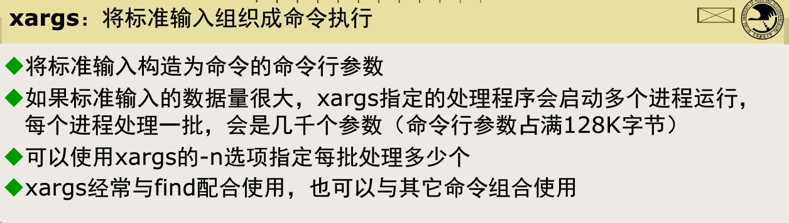
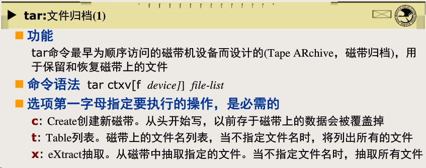
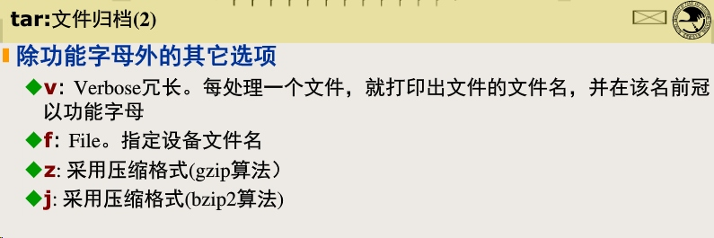
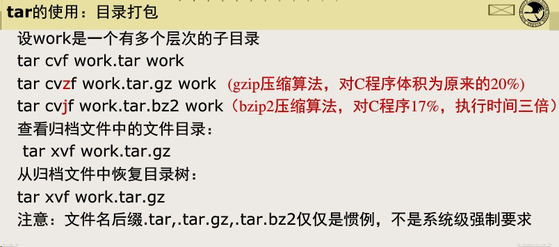
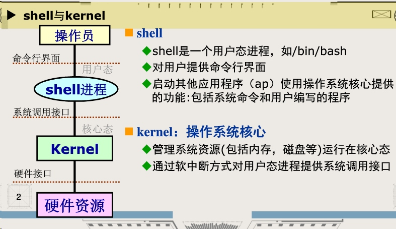

[TOC]

# find+xargs的使用

碰巧看了蒋大神的课件和网上的博客，记录一下

## xargs
Linux使用xargs为其他命令提供参数，需要和管道做一下区分。比如ls这种命令，用`|`直接传参数是不可以的，但是可以用xargs。
xargs可以解决文件名生成时因为文件太多，缓冲区空间受限导致展开失败的问题。



```
# 这个命令是错误的
find src -name \*.c -print |ls -l
# 这样是正确的
find src -name \*.c -print |xargs ls -l 
```
这个算是xarg最基本的使用了，后来发现了一些旁门左道的使用...
- 输出格式转换
```
$ cat example.txt
1 2 3 4 5 6
7 8 9 10
11 12
$ cat example.txt | xargs
1 2 3 4 5 6 7 8 9 10 11 12
$ cat example.txt | xargs | xargs -n 3
1 2 3
4 5 6
7 8 9
10 11 12
```
- 使用-d指定分割符：
```
$ echo "splitXsplitXsplitXsplit" | xargs -d X
split split split split
```
## find
find 有丰富的参数和使用技巧，就不抄博客了，仅仅把一些坑记录一下
- shell 会处理`; ( ) * `等元字符，所以使用find时要注意

- 查询目录下的c文件并在里面筛选出‘--help’所在的行数和内容
```
find src -name \*.c -exec grep -n -- -help {} /dev/null \;
```
其中，{}位置不能有空格，可以理解成查询的结果会替换在这里，/dev/null当做输入会视为空文件，输出会视为一个黑洞。
所以，如果你的`*.c`是给find看的不是让shell展开的，要么就加引号，要么转义。所以使用`();`都要变成 `\(\)\;'，否则shell会启动子shell或者将指令分割，都会导致find看不到想要的东西。
- 或指令需要加括号
```
find ~ -size +100k \( -name core -o -nane '*.tmp' \) -ok rm {} \;
```
小括号左右不能忘记加空格，与关系是默认的
## 一些小tips
- 使用--可以显式说明后面不是参数
- windows系统下，指令的解析和指令有关，但是unix/linux 下，shell是第一眼看到你输入的东西，你的输入可能在指令面前不一样。
- time(指令) 可以查看指令运行时间
- 关于tar




- shell的内部命令和外部命令
典型的内部命令cd，和通配符一样，shell见到会直接处理
典型外部命令ls，shell需要在环境变量中找一个路径，这个路径包含ls的可执行文件shell再执行他。
可以认为shell壳对应win下的cmd


# 指令记录
记录一下常用的指令

```
diff 0115bijiaozhongjian 0115zhongjiancount.txt  -y -W 100 | grep '|'
du  --max-depth=1  -h /hdd/home/asubid/242sys
cat *201812* | awk 'BEGIN{10000*srand();} {printf "%s\n",$0}' | awk -F ',' '!a[$11]++ {print}' | wc -l
```