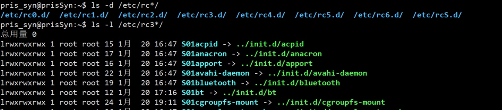
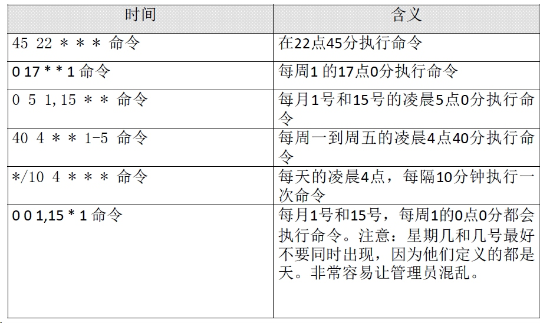
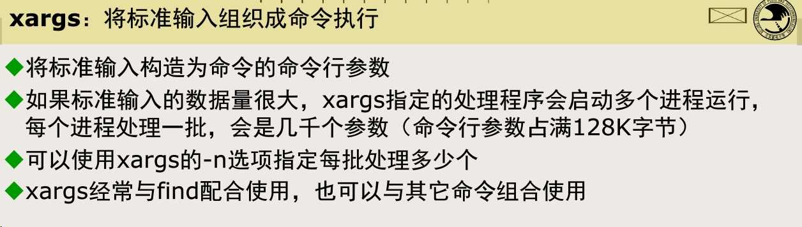
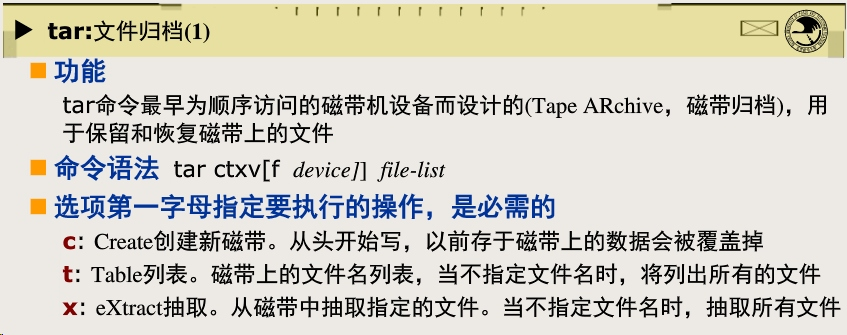

[TOC]

# linux使用的常见问题

- 回车换行与换行
- 系统语言修改
- 回车出现^H
- Ctrl Z的误用
- curl 发送http请求
## 回车换行与换行 
[回车(CR)与换行(LF)， '\r'和'\n'的区别](https://www.cnblogs.com/me115/archive/2011/04/27/2030762.html)
- win: 回车换行 0d 0a
- Unix/Linux： 换行
- Mac OS： 回车
```
pris_syn@prisSyn:~$ cat test.txt 
012
345
pris_syn@prisSyn:~$ file test.txt 
test.txt: ASCII text
pris_syn@prisSyn:~$ od -t x1 test.txt 
0000000 30 31 32 0a 33 34 35 0a
0000010
pris_syn@prisSyn:~$ unix2dos test.txt 
unix2dos: 正在转换文件 test.txt 为DOS格式...
pris_syn@prisSyn:~$ od -t x1 test.txt 
0000000 30 31 32 0d 0a 33 34 35 0d 0a
0000012
pris_syn@prisSyn:~$ file test.txt 
test.txt: ASCII text, with CRLF line terminators
pris_syn@prisSyn:~$ dos2unix test.txt 
dos2unix: 正在转换文件 test.txt 为Unix格式...
pris_syn@prisSyn:~$ unix2mac test.txt 
unix2mac: 正在转换文件 test.txt 为Mac格式...
pris_syn@prisSyn:~$ file test.txt 
test.txt: ASCII text, with CR line terminators
pris_syn@prisSyn:~$ od -t x1 test.txt 
0000000 30 31 32 0d 33 34 35 0d
0000010
```
[ASCII,Unicode,utf8编码的区别](https://blog.csdn.net/Deft_MKJing/article/details/79460485)
## 系统语言修改
有时候Linux系统cat一个windows系统传上去的文件会乱码。原因是不同系统的编码问题。Linux 一般用utf-8编码，win使用gbk编码。二者在ASCII码部分没有区别，一个字节为零，后七位表示128个字符编码。拿中文为例，gbk用两个字节编码，首位是一来与ASCII码区分，而尴尬的是utf8是三个字节表示一个中文。
```
pris_syn@prisSyn:~$ echo $LANG
zh_CN.UTF-8
pris_syn@prisSyn:~$ echo "你好" | od -t x1
0000000 e4 bd a0 e5 a5 bd 0a
0000007
pris_syn@prisSyn:~$ echo "你好" | iconv -f utf8 -t gbk | od -t x1
0000000 c4 e3 ba c3 0a
0000005
```
一般的处理办法都是把文件通过iconv,或者从来源处换成utf8编码的文件，毕竟入乡随俗。我接触过几个地方的服务器，仅仅遇到一次，不知管理员出于何目的把系统编码改成了gb18030...搞得安装py库都报错。。。。当时我是这么弄得
```
# 查看语言设置
locale
# 打印出很多LC_的东西，那个大哥把LC_ALL设置成gb18030,我到现在仍然佩服....
# ubuntu
vim /etc/default/locale
# ret hat系列旧的
vim /etc/sysconfig/i18n
# centos 7
vim /etc/locale.conf
# 设置LANG
LANG="en_US.UTF-8"
# 使其立即生效
source  对应的配置文件 
```
为什么说佩服那个大哥呢，因为他的LC_系列我依稀记得是utf8的，他把LC_ALL改了，搞得我`export  LANG=en_US.UTF-8`都没用(改临时是不想都服务器的配置，但是后来知道一直是我们用就不客气了)。LANG是优先级很低的一个变量，它指定所有与locale有关的变量的默认值。但是LC_ALL可以管所有的locale(LC_ALL > LC_* >LANG)。所以这位无名大哥下手好狠...
## 回车出现^H
这个是碰到最多最多的了，基本就是bash正常，结果一运行程序就跪了。每次都改行律后来干脆Ctrl + Backspace....
```
# 查看行律设置
(py36) pris_syn@prisSyn:~$ stty -a
speed 38400 baud; rows 24; columns 108; line = 0;
intr = ^C; quit = ^\; erase = ^?; kill = ^U; eof = ^D; 
# 发现erase没设置好
(py36) pris_syn@prisSyn:~$ stty erase ^H
(py36) pris_syn@prisSyn:~$ stty -a
speed 38400 baud; rows 24; columns 108; line = 0;
intr = ^C; quit = ^\; erase = ^H;
```
有时候vim下小键盘也会炸毛，这就没必要一个一个查改行律了，xshell下调整一下终端设置就好了。
其实有时候ls 中文目录乱码，最好看看终端模拟器的设置，不要去改服务器。

## Ctrl Z的误用
一个小故事，希望主人公看不到。一次她测试系统，运行完顺手一个Ctrl Z，我看到一个醒目的[14]  stopped.....
Ctrl Z一般是运行一个程序，发现很占用资源然后你现在想做点别的事，你就可以先将它挂起，弄好了再fg到前台，或者bg后台执行也可以，也可以用jobs查看一下挂起的进程。
这些其实都是行律在控制

- Ctrl-c Kill foreground process 
- Ctrl-z Suspend foreground process 
- Ctrl-d Terminate input, or exit shell 
- Ctrl-s Suspend output 
- Ctrl-q Resume output 
- Ctrl-l Clear screen

## curl 发送http请求
这个网上教程太多了...链接都懒得粘贴，写他的目的就是记录下怎么上校园网关...
```
curl --silent -d "user=账号&pass=密码&line=" "http://10.3.8.211/login"
```

# Linux 服务

相比于Ubuntu，更喜欢红帽系列的服务管理，我觉得红帽的Linux对RPM包默认安装的服务更加友好，比如启动管理和状态查看。

## 服务的分类

- RPM包安装的服务
- 源码包安装的服务

二者的主要区别是安装位置的不同。RPM包安装在默认位置中,源码包安装在指定位置，一般是`/usr/local/`,一般可以更改。

## 服务的启动

一般RMP包的启动脚本都在/etc/init.d/目录下。除了通用的`/etc/init.d/独立服务名 start|stop|status|restart`启动方式外，CentOS还支持`service 独立服务名 start|stop|restart|status`的方式。

## 服务的自启动

对于CentOS，有一下三种方法

- chkconfig [--level 运行级别] [独立服务名] [on|off] 
- ntsysv命令
- 修改/etc/rc.d/rc.local文件

对于Ubuntu，有点小墨迹，先看这个图：

这个图说明，ubuntu下，不同的系统运行级别有自己的目录，打开rd3的目录，我们发现里面都是软链接，指向我们之前提到的启动脚本。

> 对于以K开头的文件，系统将终止对应的服务；
> 对于以S开头的文件，系统将启动对应的服务；

这时我们已经知道怎么搞了，但是怎么命名软连接呢...没有chkconfig那么爽的工具，有点难受，后来我发现了`sysv-rc-conf `.

> 有一次安装找不到这东西，后来发现是因为他source.list就用了清华的源，添加`deb http://archive.ubuntu.com/ubuntu/ trusty main universe restricted multiverse`就好了


按空格进行将启动项反选，其他的都很好懂。

## 自启动存在的问题

对于非RPM包的程序或者干脆是自己写的程序，如何自启动呢，网上给了一大堆设置自启动脚本的办法。但是我一直都用一个比较放肆的办法，无论是centos的chkconfig和service还是ubuntu的sysv-rc-conf，能处理RMP包的服务不是因为他们有啥特异功能，就是因为他们只看/etc/init.d目录下的启动脚本。没什么其他的耦合！所以你可以把你的启动脚本放进去，虽然这样会让高手觉得不优雅(这样做多了会影响纯净的init.d目录)，但是未来某一天当另一个人接手的时候，我觉得这种方式更容易说明白。因为我们就放了一个脚本用sysv-rc-conf设置了一下，没那么复杂的步骤。

# 系统管理

很多时候要尽快的熟悉一个新的系统，而在你面前的应该只有一个虚拟终端。

## 进程和job查看

ps top pstree w who fg bg jobs & nohop kill -1 kill -9这些不多说了需要的可以去man一下。这里就说一个好玩的，pkill踢出用户~

```
$ who
pris_syn pts/2        2019-01-28 15:57 (127.0.0.1)
pris_syn pts/3        2019-02-02 18:29 (127.0.0.1)
pris_syn pts/4        2019-02-02 21:26 (127.0.0.1)
$ pkill -t -9 pts/4
$ who
pris_syn pts/2        2019-01-28 15:57 (127.0.0.1)
pris_syn pts/3        2019-02-02 18:29 (127.0.0.1)
pris_syn@prisSyn:/etc/init.d$ 
```

没事开玩笑可以，别用root乱踢，不然自己可能被圈踢。

## 系统状态查看

- vmstat [刷新延时 刷新次数]
- dmesg | grep CPU

这个命令能让你看到开机时内核检测的信息

- uptime 显示的就是top的第一行
- free [-b|-k|-m|-g-h]

cache 读取 ， buffer写入。虽然第二行才是真正的内存使用，去掉了cache和buffer，但是除了内核普通程序还是不能占用这些空间。

- cat /proc/cpuinfo

可以直接读，但是信息量太冗余，主要都是这么用：

```
# 总核数 = 物理CPU个数 X 每颗物理CPU的核数 
# 总逻辑CPU数 = 物理CPU个数 X 每颗物理CPU的核数 X 超线程数
cat /proc/cpuinfo | grep "physical id" | sort | uniq -c
     20 physical id	: 0
     20 physical id	: 1
# 上面说明，cpu有两个，每个二十线程，如果支持超线程的话，每个cpu应该是十个核
# 查看每个物理CPU中core的个数(即核数)
cat /proc/cpuinfo | grep "cpu cores" | uniq
cpu cores	: 10
# 是的，十个核
# 查看CPU信息（型号）
cat /proc/cpuinfo | grep name | uniq
model name	: Intel(R) Xeon(R) CPU E5-2630 v4 @ 2.20GHz
```

一般我都是准备一个脚本，把需要的都输出到一个文件，省的一条条查。

- uname查看系统与内核相关信息

```
pris_syn@prisSyn:~$ uname -a
Linux prisSyn 4.15.0-43-generic #46-Ubuntu SMP Thu Dec 6 14:45:28 UTC 2018 x86_64 x86_64 x86_64 GNU/Linux
pris_syn@prisSyn:~$ uname -r
4.15.0-43-generic
pris_syn@prisSyn:~$ uname -s
Linux
```

- file /bin/ls查看系统位数

网上的邪招，我确实没找到直接查看系统位数的指令...

- lsb_release -a查看发行版本
- lsof [-c|-u|-p]

之前提过的神器，用于列出进程调用或打开的文件的信息。可以根据指定字符，用户，PID列出。

## 定时任务

很多地方有这个需求。在北邮，因为网关这东西吧，，一会不联网自动就掉了，为了防止每次curl，就可以弄个定时任务。

### crontab

- -e 编辑定时任务
- -l 查看定时任务
- -r 删除当前用户所有定时任务

最简单的使用，分时天月周+指令，兄弟连的课件里面有五个很好的例子：




[TOC]

# find+xargs的使用

碰巧看了蒋大神的课件和网上的博客，记录一下

## xargs

Linux使用xargs为其他命令提供参数，需要和管道做一下区分。比如ls这种命令，用`|`直接传参数是不可以的，但是可以用xargs。
xargs可以解决文件名生成时因为文件太多，缓冲区空间受限导致展开失败的问题。



```
# 这个命令是错误的
find src -name \*.c -print |ls -l
# 这样是正确的
find src -name \*.c -print |xargs ls -l 
```

这个算是xarg最基本的使用了，后来发现了一些旁门左道的使用...

- 输出格式转换

```
$ cat example.txt
1 2 3 4 5 6
7 8 9 10
11 12
$ cat example.txt | xargs
1 2 3 4 5 6 7 8 9 10 11 12
$ cat example.txt | xargs | xargs -n 3
1 2 3
4 5 6
7 8 9
10 11 12
```

- 使用-d指定分割符：

```
$ echo "splitXsplitXsplitXsplit" | xargs -d X
split split split split
```

## find

find 有丰富的参数和使用技巧，就不抄博客了，仅仅把一些坑记录一下

- shell 会处理`; ( ) * `等元字符，所以使用find时要注意
  
- 查询目录下的c文件并在里面筛选出‘--help’所在的行数和内容

```
find src -name \*.c -exec grep -n -- -help {} /dev/null \;
```

其中，{}位置不能有空格，可以理解成查询的结果会替换在这里，/dev/null当做输入会视为空文件，输出会视为一个黑洞。
所以，如果你的`*.c`是给find看的不是让shell展开的，要么就加引号，要么转义。所以使用`();`都要变成 `\(\)\;'，否则shell会启动子shell或者将指令分割，都会导致find看不到想要的东西。

- 或指令需要加括号

```
find ~ -size +100k \( -name core -o -nane '*.tmp' \) -ok rm {} \;
```

小括号左右不能忘记加空格，与关系是默认的

## 一些小tips

- 使用--可以显式说明后面不是参数
- windows系统下，指令的解析和指令有关，但是unix/linux 下，shell是第一眼看到你输入的东西，你的输入可能在指令面前不一样。
- time(指令) 可以查看指令运行时间
- 关于tar




- shell的内部命令和外部命令
  典型的内部命令cd，和通配符一样，shell见到会直接处理
  典型外部命令ls，shell需要在环境变量中找一个路径，这个路径包含ls的可执行文件shell再执行他。
  可以认为shell壳对应win下的cmd


# 指令记录

记录一下常用的指令

```
diff 0115bijiaozhongjian 0115zhongjiancount.txt  -y -W 100 | grep '|'
du  --max-depth=1  -h /hdd/home/asubid/242sys
cat *201812* | awk 'BEGIN{10000*srand();} {printf "%s\n",$0}' | awk -F ',' '!a[$11]++ {print}' | wc -l
```